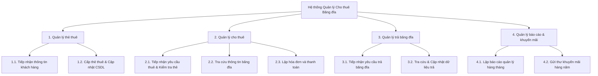
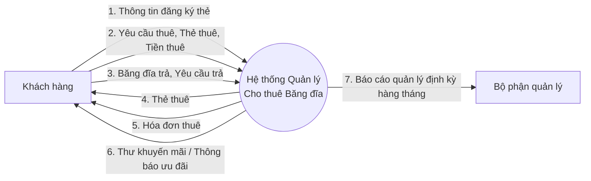
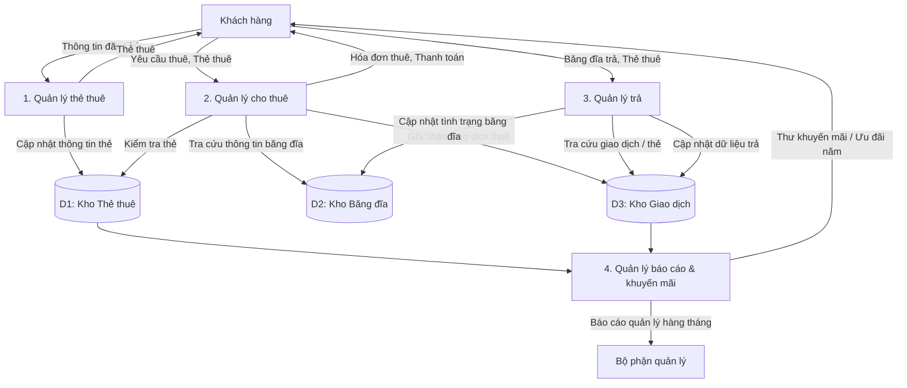

# Bài tập số 1: Hệ thống Quản lý Cho thuê Băng đĩa

## 1. Sơ đồ phân rã chức năng (BFD)

```mermaid
graph TD
    A["Hệ thống Quản lý Cho thuê Băng đĩa"] --> B1["1. Quản lý thẻ thuê"]
    A --> B2["2. Quản lý cho thuê"]
    A --> B3["3. Quản lý trả băng đĩa"]
    A --> B4["4. Quản lý báo cáo & khuyến mãi"]

    B1 --> B1_1["1.1. Tiếp nhận thông tin khách hàng"]
    B1 --> B1_2["1.2. Cấp thẻ thuê & Cập nhật CSDL"]

    B2 --> B2_1["2.1. Tiếp nhận yêu cầu thuê & Kiểm tra thẻ"]
    B2 --> B2_2["2.2. Tra cứu thông tin băng đĩa"]
    B2 --> B2_3["2.3. Lập hóa đơn và thanh toán"]

    B3 --> B3_1["3.1. Tiếp nhận yêu cầu trả băng đĩa"]
    B3 --> B3_2["3.2. Tra cứu & Cập nhật dữ liệu trả"]

    B4 --> B4_1["4.1. Lập báo cáo quản lý hàng tháng"]
    B4 --> B4_2["4.2. Gửi thư khuyến mãi hàng năm"]
```

```mermaid
graph LR
    KH["Khách hàng"] -->|1. Thông tin đăng ký thẻ| HT(("Hệ thống Quản lý<br>Cho thuê Băng đĩa"))
    KH -->|2. Yêu cầu thuê, Thẻ thuê, Tiền thuê| HT
    KH -->|3. Băng đĩa trả, Yêu cầu trả| HT

    HT -->|4. Thẻ thuê| KH
    HT -->|5. Hóa đơn thuê| KH
    HT -->|6. Thư khuyến mãi / Thông báo ưu đãi| KH

    HT -->|7. Báo cáo quản lý định kỳ hàng tháng| BQL["Bộ phận quản lý"]
```

```mermaid
graph TD
    KH["Khách hàng"] -->|Thông tin đăng ký| P1["1. Quản lý thẻ thuê"]
    P1 -->|Thẻ thuê| KH
    P1 -->|Cập nhật thông tin thẻ| D1[("D1: Kho Thẻ thuê")]

    KH -->|Yêu cầu thuê, Thẻ thuê| P2["2. Quản lý cho thuê"]
    P2 -->|Kiểm tra thẻ| D1
    P2 -->|Tra cứu thông tin băng đĩa| D2[("D2: Kho Băng đĩa")]
    P2 -->|Ghi nhận giao dịch thuê| D3[("D3: Kho Giao dịch")]
    P2 -->|Hóa đơn thuê, Thanh toán| KH

    KH -->|Băng đĩa trả, Thẻ thuê| P3["3. Quản lý trả"]
    P3 -->|Tra cứu giao dịch / thẻ| D3
    P3 -->|Cập nhật tình trạng băng đĩa| D2
    P3 -->|Cập nhật dữ liệu trả| D3

    D1 --> P4["4. Quản lý báo cáo & khuyến mãi"]
    D3 --> P4
    P4 -->|Báo cáo quản lý hàng tháng| BQL["Bộ phận quản lý"]
    P4 -->|Thư khuyến mãi / Ưu đãi năm| KH
```
